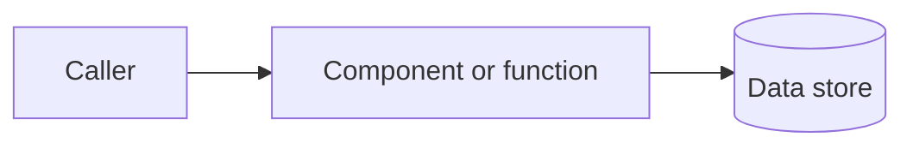

# ADR-NNNN: Short, imperative title

- **Status:** Proposed | Accepted | Deprecated | Superseded by ADR-NNNN
- **Date:** YYYY-MM-DD
- **Deciders:** team or role

## Context

What forces are at play? What problem are we solving? Cite the specific code or file paths that motivate this decision (e.g. `src/hooks/useMapOrientation.ts`, a failing test, a user complaint). Keep it concrete and avoid generalities — an ADR should be unambiguous a year from now.

Include any relevant non-functional constraints (performance, cost, privacy, hosting) that narrow the design space.

## Decision

State the decision in one or two sentences, in active voice: *"We will ..."*. Then list the mechanical consequences — the file(s) it lives in, the shape of the API, the format on the wire.

A small diagram is welcome when it clarifies the moving parts:

## Consequences

What changes because of this decision?

- **Positive:** what we gain (simpler code path, fewer round trips, less coupling, ...).
- **Negative:** what we give up or pay for (extra complexity, lock-in, higher latency, ...).
- **Neutral:** follow-on work that is no longer blocked, or new invariants we must maintain.

## Alternatives considered

| Option | Why rejected |
|--------|--------------|
| Option A | Short reason — link to benchmarks, issue, or code if relevant |
| Option B | Short reason |

## References

- Related ADRs: ADR-XXXX, ADR-YYYY
- Code: `src/path/to/relevant/file.ts`
- External docs, RFCs, issues
