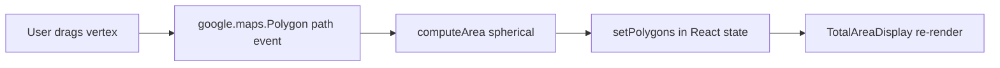

# ADR-0001: Compute polygon area in the browser

- **Status:** Accepted
- **Date:** 2026-04-18
- **Deciders:** Dakoppervlakte team

## Context

The core user outcome of Dakoppervlakte is "how many m² of roof have I outlined?". Users draw polygons on a satellite map, drag individual vertices to refine them, and see the area update instantly. Each interaction (`click`, `dblclick`, path `set_at`/`insert_at`/`remove_at` events in `src/hooks/usePolygonDrawing.ts`) can change the area, and the number has to match what the user *visually* encloses, in the same coordinate space that Google Maps rendered.

Constraints that push on this decision:

- We already load the Google Maps JavaScript API on the client — it ships a `geometry.spherical.computeArea` function that is correct on the WGS84 spheroid.
- The app has no server-side rendering of the map or polygons; all geometry originates client-side.
- The editing experience must be instant (sub-frame). A round trip to the server per vertex drag would be user-hostile.
- The project targets a serverless deployment (Vercel + Neon) where minimising per-invocation work saves both latency and cost.

## Decision

All polygon area calculations run in the browser using
`google.maps.geometry.spherical.computeArea(polygon.getPath())`, rounded via `roundArea` in `src/domain/polygon/area.ts`. The result is stored on the in-memory `PolygonEntry.area` and persisted verbatim inside the `polygons` JSONB column of the `searches` table. No server-side computation of area is ever performed; `/api/searches` simply accepts `area_m2` from the client and stores it.

## Consequences

- **Positive:**
  - Instant feedback during drawing and editing — no network latency on vertex drag.
  - One implementation, one number: the value shown on screen is the value saved to the database, so there is no reconciliation bug class.
  - The API layer stays thin and stateless. `/api/searches` has no geometry library dependency.
  - Works offline after the Maps SDK has loaded.
- **Negative:**
  - The server cannot validate the submitted `area_m2` against the submitted `polygons`. A malicious client can send a mismatched value. Acceptable because the feature is informational, not billing- or compliance-bearing.
  - Tied to the Google Maps geometry library; if we ever swap map providers we need an equivalent spherical-area function.
- **Neutral:**
  - Unit tests for the area pipeline live in `src/__tests__/domain/polygon/area.test.ts` and exercise the pure `roundArea` helper. The `computeArea` call itself is covered by the Maps stub in `src/__tests__/__mocks__/googleMaps.ts`.

## Alternatives considered

| Option | Why rejected |
|--------|--------------|
| Send `path[]` to a server endpoint, compute with a Node geodesy library, return `area_m2` | Adds a network round trip per vertex edit, which breaks the "instant feedback" UX. Also duplicates a calculation the browser can already do correctly. |
| Use a flat planar area (shoelace on lat/lng) | Wrong at Belgian latitudes by a percent or so, and scales badly further from the equator. Not defensible when users compare against cadastral values. |
| Compute client-side but re-validate on save | Doubles the code surface and still can't resolve "which number is authoritative" without a conflict-resolution rule. The informational nature of the feature doesn't justify it. |

## References

- Code: `src/domain/polygon/area.ts`, `src/hooks/usePolygonDrawing.ts`
- Related: [ADR-0002](0002-upsert-by-user-and-address.md) (why the server accepts `area_m2` verbatim)
- External: [google.maps.geometry.spherical.computeArea](https://developers.google.com/maps/documentation/javascript/reference/geometry#spherical.computeArea)
