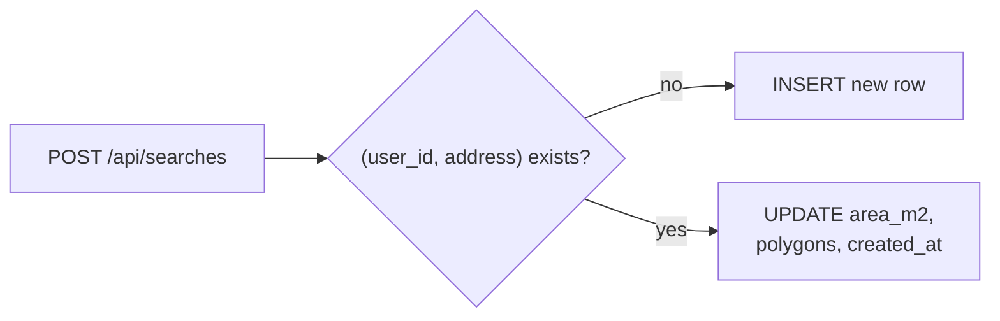

# ADR-0002: Upsert saved searches by (user_id, address)

- **Status:** Accepted
- **Date:** 2026-04-18
- **Deciders:** Dakoppervlakte team

## Context

A saved search in Dakoppervlakte captures the total area plus every polygon the user drew for a given address. The observed usage pattern — confirmed by the `SearchHistory` UI and the empty-state copy in `src/components/sidebar/SearchHistory.tsx` — is "I look up the same address repeatedly, refining the polygons each time". The second, third, and n-th save for the same address should not create history clutter; they should replace the previous snapshot.

Constraints that push on this decision:

- Neon PostgreSQL is accessed via `@neondatabase/serverless`; every API invocation opens a fresh connection, so fewer round trips per save is a measurable win.
- The history list is capped at 20 entries (`LIMIT 20` in `src/app/api/searches/route.ts`). Duplicate rows waste slots.
- Clerk `userId` is available in the `POST /api/searches` handler via `auth()`, so "owned by this user" is cheap to express at the row level.
- `address` is a free-text string coming from the geocoded search box, not a canonical identifier.

## Decision

The `searches` table carries a `UNIQUE(user_id, address)` constraint (see `src/lib/init-db.ts`). `POST /api/searches` performs a single SQL statement:

```sql
INSERT INTO searches (user_id, address, area_m2, polygons)
VALUES ($1, $2, $3, $4)
ON CONFLICT (user_id, address)
DO UPDATE SET
  area_m2    = EXCLUDED.area_m2,
  polygons   = EXCLUDED.polygons,
  created_at = NOW()
```

`created_at` is refreshed on every update so the UI's "most recent first" ordering naturally reflects the latest save.



## Consequences

- **Positive:**
  - Idempotent from the client's perspective: pressing "Save to history" ten times for the same address yields exactly one row.
  - One round trip per save; no read-then-write race.
  - History ordering stays stable and meaningful because `created_at` tracks the latest edit, not the first insert.
  - The 20-row history cap goes further — slots aren't burned on duplicates.
- **Negative:**
  - Old polygon data is lost when the user saves again for the same address. There is no version history. Acceptable because the app frames saves as "notebook", not "audit log".
  - `address` is compared verbatim. Minor formatting differences (`"Grote Markt 1"` vs `"Grote Markt 1 "`) produce two separate rows. We accept this rather than normalise aggressively and risk collapsing genuinely different addresses.
- **Neutral:**
  - `init-db.ts` has to migrate existing databases that pre-date the constraint. It runs a dedupe `DELETE` and a guarded `ALTER TABLE ADD CONSTRAINT` before the constraint is applied.

## Alternatives considered

| Option | Why rejected |
|--------|--------------|
| Always INSERT, expose a separate DELETE per row | Clutters the history and forces the user to clean up manually. Wastes the 20-row cap. |
| Client-side: fetch history, diff, decide INSERT vs UPDATE | Two round trips per save, and a TOCTOU race if the user has two tabs open. |
| Upsert by `(user_id, normalised(address))` | Requires a canonical address form we don't have. Geocoding is already lossy enough; collapsing rows silently would be worse than the current behaviour. |
| Version every save (append-only, flag latest) | Over-engineered for an informational feature with a 20-row display cap. |

## References

- Code: `src/app/api/searches/route.ts`, `src/lib/init-db.ts`, `src/hooks/useSearchHistory.ts`
- Related: [ADR-0001](0001-client-side-area-calculation.md) (why the server accepts `area_m2` verbatim)
