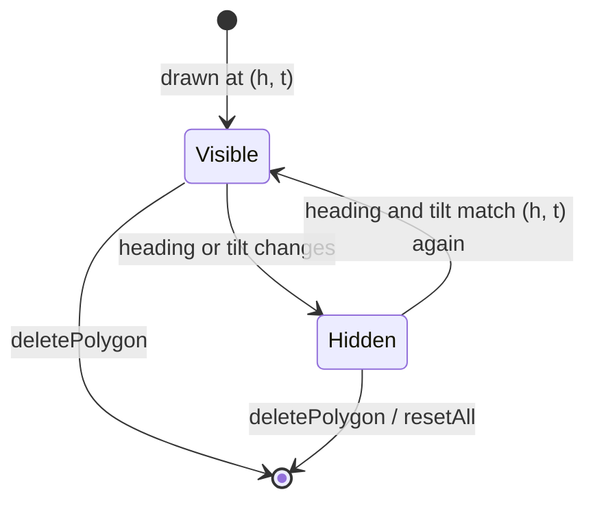

# ADR-0003: Hide polygons when the map orientation doesn't match the draw-time orientation

- **Status:** Accepted
- **Date:** 2026-04-18
- **Deciders:** Dakoppervlakte team

## Context

Satellite imagery in Google Maps is a single top-down photograph. When the user tilts the map to 45° or rotates the heading, *the image shifts* — pixels that used to sit over a particular roof now sit over a neighbouring building. A polygon drawn in top-down mode does not line up with the same roof when the user tilts into 3D, because the 3D view re-projects the image.

Users of Dakoppervlakte commonly want to draw in several orientations:

- A flat overhead polygon for the main roof footprint (heading 0°, tilt 0°).
- A tilted-view polygon to capture a dormer or chimney outline (tilt 45°).
- A rotated view when the roof is easier to trace along a cardinal axis.

Showing all of those polygons simultaneously is visually wrong — they overlap different features. But deleting them when the orientation changes is also wrong — the user wants to come back to the overhead view and keep drawing.

See `src/hooks/usePolygonDrawing.ts` (the visibility effect) and `src/hooks/useMapOrientation.ts` (the heading/tilt listeners).

## Decision

Every `PolygonEntry` captures the `heading` and `tilt` at which it was drawn. An effect in `usePolygonDrawing` runs on every `heading` or `tilt` change and attaches or detaches each polygon's map object according to:

```
visible := headingsMatch(polygon.heading, currentHeading)
        && polygon.tilt === currentTilt
```

`headingsMatch` normalises both headings into `[0, 360)` so `-90°` and `270°` compare equal. Hidden polygons are not removed from `polygons[]`, they are only detached via `polygon.setMap(null)` and `edgeLabels.setMap(null)`. They reappear the moment the user returns to a matching orientation, and they still contribute to `serializedPolygons` for persistence.



See [polygon-visibility.mermaid](../polygon-visibility.mermaid) for the full state diagram.

## Consequences

- **Positive:**
  - Users can layer polygons from multiple viewpoints without visual cross-talk.
  - No data is ever thrown away implicitly. Everything is still serialisable to the `polygons` JSONB column.
  - The logic lives in one effect and one pure comparator (`headingsMatch`), so it is straightforward to unit-test. See `src/__tests__/domain/orientation/heading.test.ts`.
- **Negative:**
  - Total area (`polygons.reduce(...)`) sums *all* polygons, including hidden ones. This is intentional — users often draw overhead + tilted views of the *same* building and want the grand total — but it can be surprising. The `excluded` flag on `PolygonEntry` lets users opt individual polygons out of the sum.
  - New contributors may be confused by "why did my polygon disappear?". The UI mitigates this with `PolygonChipBar` and `PolygonList`, which show every polygon regardless of visibility.
- **Neutral:**
  - Heading is compared exactly after normalisation. If Google Maps ever reports fractional headings mid-pan, we will need a tolerance window in `headingsMatch`.

## Alternatives considered

| Option | Why rejected |
|--------|--------------|
| Show all polygons regardless of orientation | Visually incorrect — polygons drift off their roofs as soon as the map tilts or rotates. Users reported this as broken during early testing. |
| Hide + remove on orientation change | Destroys work the user expects to keep. Users frequently flip between tilted and overhead views. |
| Re-project polygon geometry into the current view | Requires non-trivial camera math for Google Maps' 3D projection, which the public JS API does not expose. Even if we had it, the semantic intent (this polygon belongs to *that* orientation) would be lost. |
| Snap orientation to the nearest stored polygon-view on every idle | Steals camera control from the user. |

## References

- Code: `src/hooks/usePolygonDrawing.ts` (visibility effect), `src/domain/orientation/heading.ts` (`headingsMatch`), `src/lib/types.ts` (`PolygonEntry`)
- Diagrams: [polygon-visibility.mermaid](../polygon-visibility.mermaid), [domain-model.mermaid](../domain-model.mermaid)
