# ADR-0004: Split API routes into public and Clerk-protected sets

- **Status:** Accepted
- **Date:** 2026-04-18
- **Deciders:** Dakoppervlakte team

## Context

Dakoppervlakte exposes five API routes under `src/app/api/`. They fall into two very different categories based on what they touch:

| Route | Data touched | Caller |
|-------|--------------|--------|
| `GET/POST /api/counter` | Single global row in `usage_counter` (one BIGINT) | Anyone viewing the app; the header usage badge increments on every address search |
| `GET/POST /api/autogen-counter` | Single global row in `autogen_counter` | Anyone viewing the app; incremented when auto-generation succeeds |
| `GET /api/building-polygon?lat=&lng=` | No database access; thin proxy over GRB Vlaanderen + UrbIS Brussels WFS | Anyone viewing the app |
| `GET/POST/DELETE /api/searches` | `searches` table, **scoped to a per-user `user_id`** | Signed-in users only |
| `GET /api/init` | DDL on `searches` + `usage_counter` | Operator during first deploy |

The usage counters are intentionally public: the header shows them to unauthenticated visitors as social proof of the freemium tool ("calculations run: 1 245"). The building-polygon endpoint is a read-only proxy over two public Belgian WFS datasets — nothing it returns is private or rate-limited upstream. In contrast, `/api/searches` stores address history keyed by Clerk `userId`, which is personal data.

The middleware layer (`src/proxy.ts`) wraps every matched request in `clerkMiddleware`, but **intentionally does not call `auth().protect()` globally**. Per-route protection is opted into by each handler.

Relevant code:

- `src/proxy.ts` — `clerkMiddleware` wrapper, matcher, API-route early return
- `src/app/api/counter/route.ts` — no `auth()` call
- `src/app/api/autogen-counter/route.ts` — no `auth()` call
- `src/app/api/building-polygon/route.ts` — no `auth()` call
- `src/app/api/searches/route.ts` — `const { userId } = await auth(); if (!userId) return 401`

## Decision

We split the API surface into two groups and keep that split explicit in each handler:

- **Public routes:** `/api/counter`, `/api/autogen-counter`, `/api/building-polygon`. No `auth()` call. Any caller can hit them.
- **Protected routes:** `/api/searches` (all three methods). First line of every handler is `const { userId } = await auth()` followed by a 401 return if `userId` is missing.
- **Operator route:** `/api/init` is public but only creates/seeds schema and is not linked from the UI beyond the verify-your-setup step.

Clerk middleware stays at the outer layer so `auth()` is available wherever a handler chooses to call it, rather than gating the entire `/api/*` namespace.

```mermaid
flowchart LR
    C[Client] --> MW[clerkMiddleware<br/>src/proxy.ts]
    MW -->|/api/counter| PUB1[counter route]
    MW -->|/api/autogen-counter| PUB2[autogen-counter route]
    MW -->|/api/building-polygon| PUB3[building-polygon route]
    MW -->|/api/searches| PROT[searches route]
    PROT -->|auth&#40;&#41; -> userId?| CHK{userId present?}
    CHK -- no --> R401[401 Unauthorized]
    CHK -- yes --> DB[(Neon<br/>searches)]
    PUB1 --> CDB[(Neon<br/>usage_counter)]
    PUB2 --> ADB[(Neon<br/>autogen_counter)]
    PUB3 --> WFS[GRB + UrbIS WFS]
```

## Threat model

| Threat | Affected route | Assessment |
|--------|----------------|------------|
| Unauthenticated counter increments ("vandalism") | `/api/counter`, `/api/autogen-counter` | Acceptable. The counters are vanity metrics; there is no billing or rate-limit coupled to them. A script that spams the endpoint inflates the number but causes no other harm. |
| Exhausting upstream WFS quota | `/api/building-polygon` | Upstream is idempotent and publicly funded by the Flemish and Brussels governments. Our proxy adds no multiplier (one inbound = at most two outbound, GRB then UrbIS). If abuse becomes real we add rate limiting at the proxy. |
| Reading another user's search history | `/api/searches` GET | Blocked. Handler requires `userId` from Clerk, then filters `WHERE user_id = ${userId}`. No admin or shared views. |
| Writing to another user's history | `/api/searches` POST/DELETE | Blocked. Same pattern. The `userId` used in the `INSERT`/`DELETE` is the one Clerk resolved, never a client-supplied value. |

## Consequences

- **Positive:**
  - Unauthenticated visitors can view the live usage counters and auto-generate building polygons without a sign-up wall — matches the freemium framing.
  - `/api/searches` stays strictly per-user. No accidental data leak from a handler that forgets to filter by `userId`: the 401 early return makes the check load-bearing at the top.
  - The `proxy.ts` matcher stays simple: it does not need to enumerate public-vs-protected paths.
- **Negative:**
  - Each handler has to remember to call `auth()` itself. A new protected route that forgets the check would silently expose data. Mitigated by code review and by the fact that every existing protected handler opens with the same two-line pattern.
  - Public counters are increment-only from the client's perspective; they can be spammed. See threat model.
- **Neutral:**
  - If a future route needs a different auth model (e.g., API key), it can be added without reshaping `proxy.ts`.
  - The `/api/init` operator endpoint is technically public and could be hit by a bot. It is idempotent (`CREATE TABLE IF NOT EXISTS`, `INSERT ... ON CONFLICT DO NOTHING`), but we should still plan to gate it behind an env-flag or remove it once proper migrations land — see [migrations.md](../migrations.md).

## Alternatives considered

| Option | Why rejected |
|--------|--------------|
| Protect everything behind Clerk (`auth().protect()` in middleware) | Breaks the "unauthenticated visitor sees usage count and can draw on the map" experience. Dakoppervlakte is deliberately try-before-you-sign-up. |
| Rate-limit public routes via Vercel Edge middleware or Upstash | Deferred. The counter abuse surface is low-value (vanity only). We will add rate limiting only if we observe actual abuse or upstream WFS complaints. |
| API keys for public routes | Over-engineering for a freemium app with no paid tier. Adds a signup-for-key flow that defeats the whole "try immediately" pitch. |
| Move the `auth()` check into middleware per-path | `clerkMiddleware` already runs per-request. The per-handler `auth()` call is the idiomatic Clerk pattern in App Router and keeps the failure-mode visible next to the DB query. |

## References

- Code: `src/proxy.ts`, `src/app/api/counter/route.ts`, `src/app/api/autogen-counter/route.ts`, `src/app/api/building-polygon/route.ts`, `src/app/api/searches/route.ts`
- Related: [ADR-0002](0002-upsert-by-user-and-address.md) (per-user upsert key), [auth-flow.mermaid](../auth-flow.mermaid)
- External: [Clerk Next.js App Router — protecting routes](https://clerk.com/docs/references/nextjs/auth-middleware)
