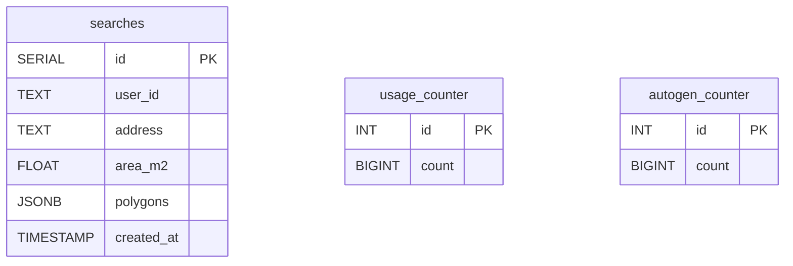

# Architecture Overview

Dakoppervlakte is a Next.js 16 application using the App Router. It follows a layered component architecture with a single smart orchestrator component, dumb presentational components, and custom hooks for side effects.

## Component Layers

```mermaid
flowchart TD
    subgraph Pages ["Pages (app/[locale]/page.tsx)"]
        Page["Page — Shell only, no logic"]
    end

    subgraph Smart ["Smart Components"]
        App["DakoppervlakteApp — Thin orchestrator, wires 7 hook calls"]
    end

    subgraph Hooks ["Custom Hooks"]
        GM["useGoogleMaps"]
        MO_HOOK["useMapOrientation"]
        GEO["useGeocoding"]
        PD["usePolygonDrawing"]
        UC["useUsageCounter"]
        SH["useSearchHistory"]
    end

    subgraph Extracted ["Extracted Components"]
        HDR["Header"]
    end

    subgraph Sidebar ["Sidebar Components (dumb)"]
        AS["AddressSearch"]
        RC["RotationControls"]
        PL["PolygonList"]
        TA["TotalAreaDisplay"]
        SR["SaveResetControls"]
        DH["DrawingHint"]
        SG["StepGuide"]
        HI["SearchHistory"]
        DTB["DrawerTitleBlock"]
        DF["DrawerFooter"]
    end

    subgraph Layout ["Layout Components"]
        SBD["SidebarDrawer"]
        SBB["SidebarBody"]
    end

    subgraph Map ["Map Components (dumb)"]
        MV["MapView"]
        MO["MapOverlayControls"]
        DO["DrawingOverlay"]
        PCB["PolygonChipBar"]
    end

    subgraph UI ["UI Primitives (stateless)"]
        BTN["Button"]
        INP["Input"]
        BDG["Badge"]
        LOGO["Logo"]
        SPIN["Spinner"]
        HB["HamburgerButton"]
    end

    subgraph API ["API Routes (app/api/)"]
        CTR["/api/counter"]
        ACTR["/api/autogen-counter"]
        SCH["/api/searches"]
        BLD["/api/building-polygon"]
        INIT["/api/init"]
    end

    subgraph External ["External Services"]
        GMAP["Google Maps API"]
        CLK["Clerk Auth"]
        NEON["Neon PostgreSQL"]
        GRB["GRB Vlaanderen WFS"]
        URB["UrbIS Brussels WFS"]
    end

    Page --> App
    App --> GM & MO_HOOK & GEO & PD & UC & SH
    App --> HDR
    App --> SBD
    SBD --> SBB
    SBD --> DTB & DF
    App --> AS & RC & PL & TA & SR & DH & SG & HI
    App --> MV & MO & DO & PCB
    HDR --> LOGO & BTN & HB
    AS --> BTN & INP
    SR & DH --> BTN
    PL --> BDG
    MV --> SPIN
    GM --> GMAP
    MO_HOOK --> GMAP
    GEO --> GMAP
    PD --> GMAP
    UC --> CTR
    UC --> ACTR
    SH --> SCH
    SCH --> CLK
    SCH --> NEON
    CTR --> NEON
    ACTR --> NEON
    BLD --> GRB
    BLD --> URB
    INIT --> NEON
```



## Data Flow

State lives in custom hooks and is wired together by `DakoppervlakteApp` (thin orchestrator). There is no global state management library (no Redux, Zustand, etc.). Data flows top-down via props.

| State | Owner | Description |
|-------|-------|-------------|
| `heading`, `tilt`, `zoom` | `useMapOrientation` | Map orientation, synced bidirectionally with the map instance via `idle` and `zoom_changed` listeners |
| `canEnable3D`, `is3D` | `useMapOrientation` | Computed: `zoom >= 14` and `tilt === 45` respectively |
| `address`, `searching`, `searchError` | `useGeocoding` | Address search form state and geocoding lifecycle |
| `saved`, `autoGenerate`, `autoGenerateError`, `drawerOpen`, `searchFormCollapsed` | `DakoppervlakteApp` | UI coordination state: persistence flag, auto-generate toggle + error, mobile drawer open/closed, collapsed search form |
| `mode`, `pointCount`, `polygons` | `usePolygonDrawing` | Drawing FSM state and completed polygon list |
| `mapRef`, `mapInstanceRef`, `geocoderRef`, `mapLoaded` | `useGoogleMaps` | Google Maps SDK and instance lifecycle |
| `count` (search), `count` (autogen) | `useUsageCounter` (invoked twice with different `endpoint`/`storageKey`) | Global address-search counter and global auto-generate counter |
| `history` | `useSearchHistory` | Authenticated user's saved searches |

## Hook Composition

`DakoppervlakteApp` (~279 lines) is a thin orchestrator that wires up seven hook calls (`useUsageCounter` is invoked twice) plus the `Header`, the sidebar drawer, and the map. It holds five pieces of local UI state — `saved`, `autoGenerate`, `autoGenerateError`, `drawerOpen`, `searchFormCollapsed` — and defines six `useCallback`s (`handleSearch`, `handleRestore`, `handleSave`, `handleReset`, `handleStartDrawing`, `handleExpandSearch`) that coordinate across hooks. See [hook-composition.mermaid](hook-composition.mermaid) for the full diagram.

| Hook | Concern | Depends On |
|------|---------|------------|
| `useGoogleMaps` | Script loading, map + geocoder instance creation | -- |
| `useMapOrientation` | Heading, tilt, zoom state; bidirectional map sync; rotation/tilt callbacks | `useGoogleMaps` (`mapInstanceRef`, `mapLoaded`) |
| `useGeocoding` | Address search, geocoding API call, error handling | `useGoogleMaps` (`mapInstanceRef`, `geocoderRef`) |
| `usePolygonDrawing` | Drawing FSM, polygon CRUD, serialization, orientation-based visibility | `useGoogleMaps` (`mapInstanceRef`), `useMapOrientation` (`heading`, `tilt`) |
| `useUsageCounter` | Global calculation counter fetch + increment | -- |
| `useSearchHistory` | Per-user search CRUD via `/api/searches` | Clerk `isSignedIn` boolean |

### Extracted components

| Component | Extracted from | Props |
|-----------|---------------|-------|
| `Header` | `DakoppervlakteApp` | `usageCount: number \| null`, `autogenCount: number \| null`, `onMenuClick: () => void`, `drawerOpen: boolean`, `drawerId: string` |

`Header` contains the Logo, both usage-count displays (search + auto-generate), the mobile `HamburgerButton`, and Clerk auth buttons (SignIn/SignUp/UserButton). It uses `useTranslations()` internally.

## Key Design Decisions

1. **Client-side geometry** -- All area calculations run in the browser using `google.maps.geometry.spherical.computeArea()`. No server-side computation. See [ADR-0001](adr/0001-client-side-area-calculation.md).

2. **Orientation-based polygon visibility** -- Polygons are tagged with the `heading` and `tilt` at which they were drawn. When the map rotates to a different orientation, those polygons are hidden. This lets users draw separate polygon sets for different perspectives of the same roof. See [ADR-0003](adr/0003-orientation-based-polygon-visibility.md) and [polygon-visibility.mermaid](polygon-visibility.mermaid).

3. **Ref-based drawing state** -- `usePolygonDrawing` stores temporary drawing artifacts (markers, preview line, path) in refs rather than React state, avoiding unnecessary re-renders during drawing.

4. **Upsert-based save** -- When saving a search, the database upserts on `(user_id, address)`. Repeated calculations for the same address update the existing row. See [ADR-0002](adr/0002-upsert-by-user-and-address.md).

5. **Serverless database** -- Neon PostgreSQL with the `@neondatabase/serverless` driver, optimized for edge/serverless environments. No connection pooling.

6. **Inline styles** -- Components use React `CSSProperties` objects directly instead of CSS modules or utility classes (Tailwind is configured but mostly unused in component code).

## Database Schema



The `searches` table carries a `UNIQUE(user_id, address)` constraint enforced at the table level — see `src/lib/init-db.ts`.

- `searches.polygons` stores serialized `PolygonData[]` (each with `id`, `label`, `area`, `path[]`, `heading`, `tilt`)
- `usage_counter` has a single row (`id = 1`) tracking the global address-search count
- `autogen_counter` has a single row (`id = 1`) tracking how many addresses have been auto-generated into a building polygon via the GRB/UrbIS lookup

Schema bootstrap is handled by an ad-hoc init script (`src/lib/init-db.ts`) and a public `GET /api/init` endpoint. Both are throwaway glue — see [migrations.md](migrations.md) for the current state and the planned migration to drizzle-kit.

## Request Lifecycle

Incoming requests are handled by a single middleware file at `src/proxy.ts`. This file composes Clerk authentication with next-intl locale routing in a specific order:

1. **Clerk middleware wraps everything.** The exported default is `clerkMiddleware(...)` from `@clerk/nextjs/server`. This runs Clerk's session resolution on every matched request, making `auth()` available in downstream route handlers.

2. **API routes skip locale routing.** Inside the Clerk middleware callback, requests whose pathname starts with `/api/` receive a plain `NextResponse.next()`. This prevents next-intl from prefixing API paths with a locale segment (e.g., `/en/api/counter`).

3. **Page requests go through next-intl.** All other requests are passed to `createIntlMiddleware(routing)`, which detects or redirects to a locale based on the `[locale]` route segment. The routing configuration (`src/i18n/routing.ts`) defines three supported locales: **nl** (default), **en**, and **fr**.

4. **Locale resolution at render time.** `src/i18n/request.ts` exports a `getRequestConfig` that loads the correct message bundle from `messages/{locale}.json` based on the `[locale]` segment.

5. **next-intl plugin in `next.config.ts`.** The Next.js config is wrapped with `createNextIntlPlugin()`, which wires up the server-side request config automatically.

6. **Per-route auth for protected endpoints.** There is no global route protection via middleware. Protected API routes (e.g., `/api/searches`) call `auth()` from `@clerk/nextjs/server` at the top of each handler and return a 401 if no `userId` is present. Public routes (`/api/counter`, `/api/building-polygon`, `/api/init`) skip the `auth()` check entirely.

```
Request
  |
  v
src/proxy.ts (clerkMiddleware wraps all matched routes)
  |
  +-- pathname starts with /api/ ?
  |     YES --> NextResponse.next() --> API route handler
  |                                       |
  |                                       +-- auth() called per-route (protected)
  |                                       +-- no auth check (public)
  |
  |     NO  --> createIntlMiddleware(routing) --> locale detect/redirect
  |               --> app/[locale]/page.tsx --> DakoppervlakteApp (client)
```

**Note:** The middleware file is named `src/proxy.ts` rather than the conventional `middleware.ts`. The matcher pattern covers all routes except static assets.

## Deployment Topology

The app runs as a single Next.js deployment on Vercel. The browser talks directly to two third-party JS SDKs (Google Maps, Clerk) and to our own `/api/*` routes. Server-side, Vercel's Node runtime reaches Neon for persistence, the two Belgian WFS providers for building polygons, and Clerk for session verification.

```mermaid
flowchart LR
    subgraph Client ["Browser (client)"]
        UI[Next.js React app<br/>DakoppervlakteApp]
    end

    subgraph Vercel ["Vercel (Next.js deployment)"]
        MW[proxy.ts<br/>clerkMiddleware + next-intl]
        RSC[Server Components<br/>app/&#91;locale&#93;/page.tsx]
        API1["/api/counter"]
        API2["/api/autogen-counter"]
        API3["/api/building-polygon"]
        API4["/api/searches"]
        API5["/api/init"]
    end

    subgraph DB ["Managed data"]
        NEON[(Neon PostgreSQL<br/>searches, usage_counter,<br/>autogen_counter)]
    end

    subgraph Third ["Third-party services"]
        GMAPS[Google Maps<br/>JavaScript API]
        CLERK[Clerk<br/>auth + sessions]
        GRB[GRB Vlaanderen<br/>WFS]
        URBIS[UrbIS Brussels<br/>WFS]
    end

    UI -->|HTML, JSON| MW
    MW --> RSC
    MW --> API1
    MW --> API2
    MW --> API3
    MW --> API4
    MW --> API5

    UI -.->|Maps JS SDK, tiles| GMAPS
    UI -.->|Sign-in UI, session cookie| CLERK

    API1 --> NEON
    API2 --> NEON
    API4 --> NEON
    API5 --> NEON
    API3 -->|GetFeature bbox| GRB
    API3 -->|GetFeature bbox fallback| URBIS
    API4 -->|auth&#40;&#41; server-side| CLERK
```



- **Browser -> Vercel**: HTML for pages, JSON for all `/api/*` routes.
- **Browser -> Google Maps**: loaded via `useGoogleMaps` directly; map tiles, Geocoder, drawing, geometry helpers.
- **Browser -> Clerk**: hosted sign-in/sign-up UI and a session cookie set on the app domain. See [auth-flow.mermaid](auth-flow.mermaid).
- **Vercel -> Neon**: `@neondatabase/serverless` over HTTPS; no connection pooling. Every API invocation opens a fresh connection.
- **Vercel -> GRB / UrbIS**: unauthenticated `GET .../wfs?service=WFS&request=GetFeature&bbox=...` calls. GRB is queried first; UrbIS is a fallback when GRB returns no features.
- **Vercel -> Clerk**: server-side session verification via `auth()` from `@clerk/nextjs/server`.

## Internationalization

The app supports three locales: **nl** (Dutch, default), **en** (English), **fr** (French). Routing uses a dynamic `[locale]` segment. Locale detection and redirection are handled by `next-intl` middleware composed inside the Clerk middleware wrapper (see Request Lifecycle above).

Translation namespaces: `Metadata`, `Header`, `App`, `Sidebar`, `Drawing`, `Map`, `StepGuide`, `Common`, `Errors`.
