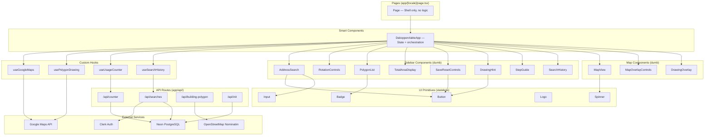
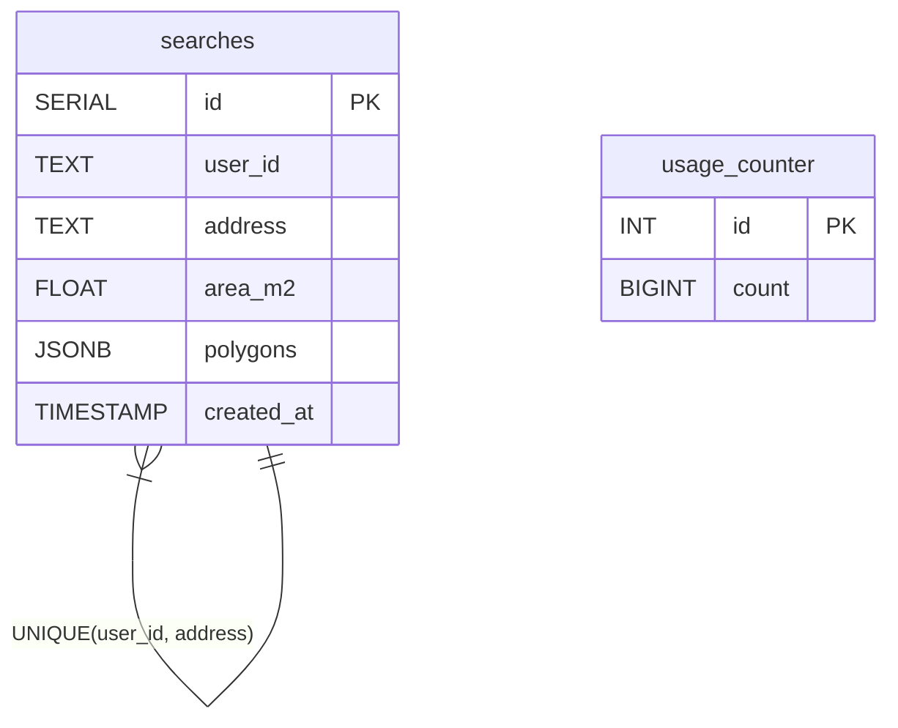

# Architecture Overview

Dakoppervlakte is a Next.js 16 application using the App Router. It follows a layered component architecture with a single smart orchestrator component, dumb presentational components, and custom hooks for side effects.

## Component Layers



## Data Flow

State lives in `DakoppervlakteApp` and its hooks. There is no global state management library (no Redux, Zustand, etc.). Data flows top-down via props.

| State | Owner | Description |
|-------|-------|-------------|
| `heading`, `tilt`, `zoom` | `DakoppervlakteApp` | Map orientation, synced bidirectionally with the map instance |
| `address`, `searching`, `searchError` | `DakoppervlakteApp` | Address search form state |
| `saved` | `DakoppervlakteApp` | Whether current calculation has been persisted |
| `mode`, `pointCount`, `polygons` | `usePolygonDrawing` | Drawing FSM state and completed polygon list |
| `mapRef`, `mapInstanceRef`, `geocoderRef`, `mapLoaded` | `useGoogleMaps` | Google Maps SDK and instance lifecycle |
| `count` | `useUsageCounter` | Global calculation counter |
| `history` | `useSearchHistory` | Authenticated user's saved searches |

## Key Design Decisions

1. **Client-side geometry** -- All area calculations run in the browser using `google.maps.geometry.spherical.computeArea()`. No server-side computation.

2. **Orientation-based polygon visibility** -- Polygons are tagged with the `heading` and `tilt` at which they were drawn. When the map rotates to a different orientation, those polygons are hidden. This lets users draw separate polygon sets for different perspectives of the same roof.

3. **Ref-based drawing state** -- `usePolygonDrawing` stores temporary drawing artifacts (markers, preview line, path) in refs rather than React state, avoiding unnecessary re-renders during drawing.

4. **Upsert-based save** -- When saving a search, the database upserts on `(user_id, address)`. Repeated calculations for the same address update the existing row.

5. **Serverless database** -- Neon PostgreSQL with the `@neondatabase/serverless` driver, optimized for edge/serverless environments. No connection pooling.

6. **Inline styles** -- Components use React `CSSProperties` objects directly instead of CSS modules or utility classes (Tailwind is configured but mostly unused in component code).

## Database Schema



- `searches.polygons` stores serialized `PolygonData[]` (each with `id`, `label`, `area`, `path[]`, `heading`, `tilt`)
- `usage_counter` has a single row (`id = 1`) tracking the global calculation count

## Request Lifecycle

Incoming requests are handled by a single middleware file at `src/proxy.ts`. This file composes Clerk authentication with next-intl locale routing in a specific order:

1. **Clerk middleware wraps everything.** The exported default is `clerkMiddleware(...)` from `@clerk/nextjs/server`. This runs Clerk's session resolution on every matched request, making `auth()` available in downstream route handlers.

2. **API routes skip locale routing.** Inside the Clerk middleware callback, requests whose pathname starts with `/api/` receive a plain `NextResponse.next()`. This prevents next-intl from prefixing API paths with a locale segment (e.g., `/en/api/counter`).

3. **Page requests go through next-intl.** All other requests are passed to `createIntlMiddleware(routing)`, which detects or redirects to a locale based on the `[locale]` route segment. The routing configuration (`src/i18n/routing.ts`) defines three supported locales: **nl** (default), **en**, and **fr**.

4. **Locale resolution at render time.** `src/i18n/request.ts` exports a `getRequestConfig` that loads the correct message bundle from `messages/{locale}.json` based on the `[locale]` segment.

5. **next-intl plugin in `next.config.ts`.** The Next.js config is wrapped with `createNextIntlPlugin()`, which wires up the server-side request config automatically.

6. **Per-route auth for protected endpoints.** There is no global route protection via middleware. Protected API routes (e.g., `/api/searches`) call `auth()` from `@clerk/nextjs/server` at the top of each handler and return a 401 if no `userId` is present. Public routes (`/api/counter`, `/api/building-polygon`, `/api/init`) skip the `auth()` check entirely.

```
Request
  |
  v
src/proxy.ts (clerkMiddleware wraps all matched routes)
  |
  +-- pathname starts with /api/ ?
  |     YES --> NextResponse.next() --> API route handler
  |                                       |
  |                                       +-- auth() called per-route (protected)
  |                                       +-- no auth check (public)
  |
  |     NO  --> createIntlMiddleware(routing) --> locale detect/redirect
  |               --> app/[locale]/page.tsx --> DakoppervlakteApp (client)
```

**Note:** The middleware file is named `src/proxy.ts` rather than the conventional `middleware.ts`. The matcher pattern covers all routes except static assets.

## Internationalization

The app supports three locales: **nl** (Dutch, default), **en** (English), **fr** (French). Routing uses a dynamic `[locale]` segment. Locale detection and redirection are handled by `next-intl` middleware composed inside the Clerk middleware wrapper (see Request Lifecycle above).

Translation namespaces: `Metadata`, `Header`, `App`, `Sidebar`, `Drawing`, `Map`, `StepGuide`, `Common`, `Errors`.
