# Database migrations

Dakoppervlakte uses Neon (serverless PostgreSQL) for two small tables and a pair of single-row counters. There is **no migration tooling** in use today — schema changes are applied by an ad-hoc init script.

This document captures the current state, its limitations, and the planned path to proper migrations. It intentionally errs on the side of being explicit: the init code is **throwaway glue**, not a pattern to extend.

## Current state

Schema bootstrap lives in `src/lib/init-db.ts` and is run on demand:

| Trigger | Command | Intended use |
|---------|---------|--------------|
| CLI script | `npm run db:init` (runs `tsx src/lib/init-db.ts`) | Local dev; production cutover with `DATABASE_URL` pointed at prod |
| HTTP endpoint | `GET /api/init` (`src/app/api/init/route.ts`) | First deploy on Vercel when no local tooling is available |

The script uses three defensive-SQL techniques to be idempotent:

1. `CREATE TABLE IF NOT EXISTS` for every table.
2. `ALTER TABLE ... ADD COLUMN IF NOT EXISTS` for columns added after the original schema (`polygons JSONB`).
3. A guarded `DO $$ ... IF NOT EXISTS (SELECT 1 FROM pg_constraint ...) THEN ALTER TABLE ADD CONSTRAINT` block for the `UNIQUE(user_id, address)` constraint on `searches`.

It also runs a one-time `DELETE FROM searches a USING searches b WHERE a.id < b.id AND a.user_id = b.user_id AND a.address = b.address` to collapse pre-constraint duplicates before the constraint is applied.

```mermaid
flowchart LR
    Op[Operator] -->|npm run db:init| CLI[tsx src/lib/init-db.ts]
    Op -->|curl /api/init| API[GET /api/init route]
    CLI -->|neon&#40;DATABASE_URL&#41;| Neon[(Neon PostgreSQL)]
    API -->|neon&#40;DATABASE_URL&#41;| Neon
    Neon --> T1[searches]
    Neon --> T2[usage_counter]
    Neon --> T3[autogen_counter]
```

> Note: `/api/init` creates the *minimal* schema (`searches` + `usage_counter`, no `polygons` column, no `UNIQUE` constraint). `npm run db:init` creates the *full* schema including `polygons JSONB`, the dedupe `DELETE`, and the `UNIQUE(user_id, address)` constraint. Always prefer `db:init` for a real cutover.

## Known limitations

The current approach is small and obvious, and that is the point — but it has real constraints:

- **No version tracking.** There is no `schema_migrations` (or similar) table. The init script has no idea what state the database is in, only that every statement it runs is survivable against an arbitrary starting point.
- **No rollback.** Every change is forward-only. A bad column addition has to be reverted by hand.
- **No migration history.** There is no record of when a given change was applied. In an incident you cannot point to "constraint X was added on Y".
- **Ordering is manual.** New changes have to be appended in the right place inside `main()` and be compatible with every previous statement having already run.
- **The `/api/init` endpoint is public.** It is idempotent, but it accepts unauthenticated traffic. See [ADR-0004](adr/0004-public-vs-protected-api-routes.md) threat model.
- **Safety relies entirely on idempotent SQL.** The moment someone adds a non-idempotent statement (e.g. a `DROP COLUMN`) the script stops being re-runnable on an already-migrated database.

The team already treats `init-db.ts` as throwaway glue: changes to it are kept minimal rather than polished, precisely because it is on the removal list.

## Roadmap: move to drizzle-kit

`drizzle-orm` and `drizzle-kit` are already in `package.json` (`dependencies`), so the tooling is pre-installed. The next iteration will:

1. Define the current schema declaratively in `src/db/schema.ts` using drizzle.
2. Generate an initial migration with `drizzle-kit generate` that matches the live schema exactly (the baseline).
3. Add a `drizzle.config.ts` pointed at Neon, and a new `npm run db:migrate` that runs `drizzle-kit migrate` against `DATABASE_URL`.
4. Replace `src/lib/init-db.ts` and `src/app/api/init/route.ts` with a deployment hook (Vercel build step or a protected route) that runs `drizzle-kit migrate`.
5. Remove the `/api/init` route and delete `init-db.ts` in the same PR that lands drizzle-kit.

Schema changes after that point follow the standard drizzle workflow: edit `schema.ts`, run `drizzle-kit generate` to diff and emit a numbered migration, commit both the schema change and the generated SQL, `drizzle-kit migrate` on deploy.

## References

- Code: `src/lib/init-db.ts`, `src/app/api/init/route.ts`, `src/lib/db.ts`
- ADRs: [ADR-0002](adr/0002-upsert-by-user-and-address.md) (why `UNIQUE(user_id, address)` exists), [ADR-0004](adr/0004-public-vs-protected-api-routes.md)
- External: [drizzle-kit migrations](https://orm.drizzle.team/kit-docs/overview)
